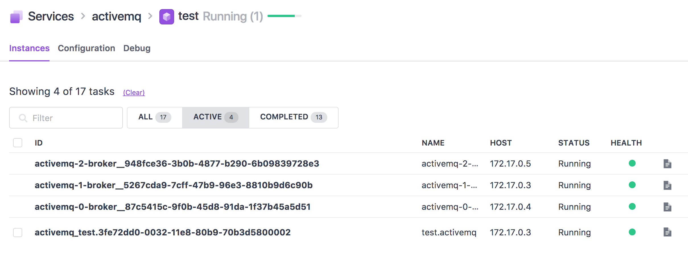

ActiveMQ Scheduler for DC/OS
------------------------

# ActiveMQ scheduler for DC/OS



* ActiveMQ endpoints
 * `openwire.<activemq-frameworkname>.l4lb.thisdcos.directory:61616`
 * `amqp.<activemq-frameworkname>.l4lb.thisdcos.directory:5672`
 * `stomp.<activemq-frameworkname>.l4lb.thisdcos.directory:61613`
 * `mqtt.<activemq-frameworkname>.l4lb.thisdcos.directory:1883`
 * If service is running under the sub group, endpoint is: `openwire.<subgroup><servicename>.l4lb.thisdcos.directory:61616`

# How to use 
## Build
```bash
$ cd frameworks/activemq/
$ ./build.sh
```

## Use Universe

* Serve `frameworks/activemq/build/distributions/*.zip` files in httpd.
* Serve `sdk/bootstrap/bootstrap` file in httpd.
* Copy `frameworks/activemq/universe/*` to `universe/repo/B/beta-activemq/0/*`
* Replace file assets in `resource.json` with:
```json
    {
      "jre-tar-gz": "https://downloads.mesosphere.com/java/jre-8u152-linux-x64.tar.gz",
      "libmesos-bundle-tar-gz": "https://downloads.mesosphere.io/libmesos-bundle/libmesos-bundle-master-28f8827.tar.gz"
    }
``` 

* Replace `bootstrap` asset in `resource.json` with proper location.
* Replcae `scheduler-zip` asset in `resource.json` with proper location.
* Replcae `executor-zip` asset in `resource.json` with proper location.

* Build local universe.

## Use pre-built docker image

* Use `minyk/dcos-activemq:v0.1` from Docker hub, and marathon.json(frameworks/activemq/docker/marathon.json).

# Limitations
* ActiveMQ Docker image is static: `minyk/activemq:5.15.2`. See this: https://github.com/minyk/activemq
* ActiveMQ node count is static: `3`
